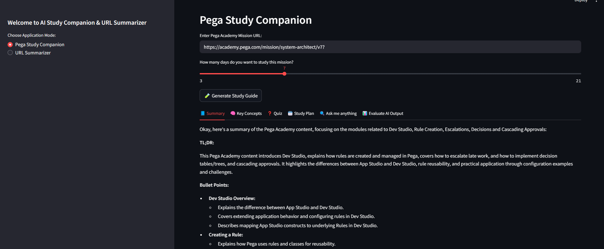
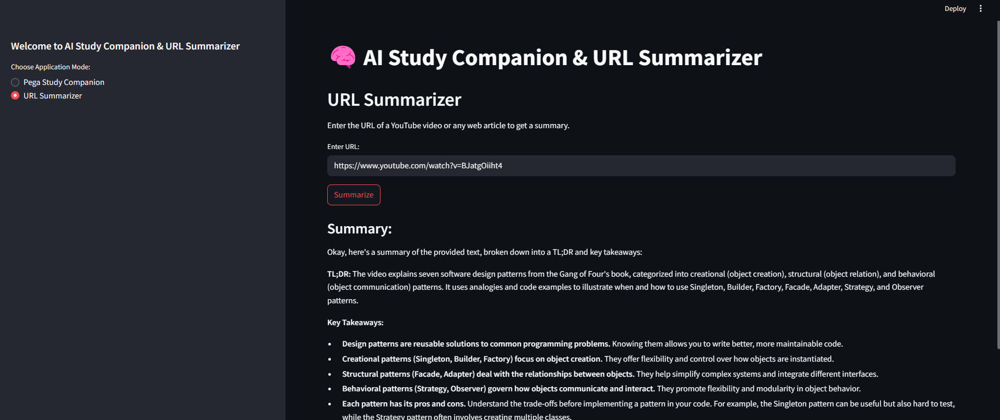
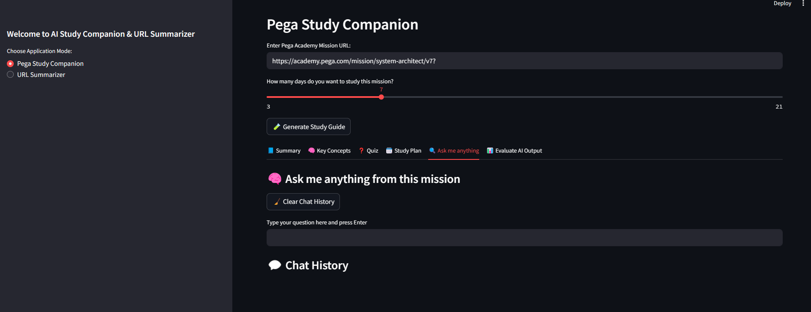

# 🧠 GenAI Capstone - AI Study Companion

Welcome to the **GenAI Study Companion**, a multi-modal, GenAI-powered learning assistant that helps you summarize Pega Academy missions, YouTube videos, and blog articles—then turns them into study plans, quizzes, and more.

🔗 **Live App**: [https://genai-summarize.streamlit.app/](https://genai-summarize.streamlit.app/)

---

## ✨ Features

### 📘 Pega Mission Study Guide
- Scrapes multi-step Pega Academy missions.
- Generates summaries, quizzes, and key concepts.
- Provides structured JSON and timeline-style study plans.
- Q&A support with vector search + Gemini fallback.

### 📺 YouTube Summarizer
- Summarizes videos via transcripts.
- Handles long transcripts by chunking.
- Gemini summarization for insights and key points.

### 📰 Blog & Article Summarizer
- Enter any blog or article URL.
- Extracts readable content, generates bullet summary, highlights, and topics.

### 💬 Ask Me Anything (RAG)
- Asks free-form questions about Pega missions.
- Uses FAISS vector store and Gemini fallback.
- Displays chat history with timestamps and feedback.

### ✅ GenAI Features Covered
- Gemini Pro API (text + summarization + evaluation)
- Few-shot prompting
- Retrieval Augmented Generation (RAG)
- Vector embeddings with FAISS
- Document understanding (video + web)
- Controlled generation with structured JSON
- Long-context handling
- Evaluation of AI outputs (summary & quiz)

---

## 🚀 Running the Application Locally

### 1. Clone the Repository
```bash
git clone https://github.com/yourusername/genai-capstone.git
cd genai-capstone
```

### 2. Create and Activate a Virtual Environment
```bash
python -m venv venv
source venv/bin/activate  # On Windows use venv\Scripts\activate
```
### 3. Install the Required Dependencies
```bash
pip install -r requirements.txt
```
### 4. Set the Gemini API Key
Set the GOOGLE_API_KEY environment variable:

```bash
export GOOGLE_API_KEY="your_api_key"  # On Windows use: set GOOGLE_API_KEY=your_api_key
```

## 🧪 Running the Apps
You can run either app directly or both through a single launcher.

Option A: Standalone Apps
```bash
streamlit run genai_urlsumriz/app.py
# This launches the YouTube/blog summarizer.
```
```bash
streamlit run AIstudy_companion/app.py
# This launches the full Pega study companion with a radio toggle for modes.
```
## 📂 Project Structure
```bash
genai-capstone/
│
├── AIstudy_companion/
│   ├── app.py                    # Streamlit main app (radio-based multi-tool)
│   └── utils/                    # All core processing logic
│       ├── scrape_mission.py
│       ├── llm_utils.py
│       ├── vectore_store.py
│       ├── evaluation_utils.py
│       └── timeline_utils.py
│
├── genai_urlsumriz/
│   └── app.py                    # Standalone video/blog summarizer
│
├── assets/                       # Screenshots, styles, or images
├── requirements.txt
└── README.md
```

## 🔮 Limitations
Gemini API context window limits.

Limited evaluation scoring (mostly qualitative).

No login/authentication or persistent user data.

Transcripts and blog parsing may fail for noisy content.

## 🌱 Future Enhancements
Add file/document upload (PDF, DOCX).

Daily learning reminders and progress tracking.

Save and revisit previous study sessions.

Collaborative study group rooms.

Enhanced visualizations and analytics.

## 🧑‍💻 Author
Built with ❤️ by manGo
### 📅 Capstone Project - Google GenAI Intensive Q1 2025
### 🌐 Live App: https://genai-summarize.streamlit.app/

## 📸 Screenshots

### 🔹 Summary View


### 🔹 Video Summarizer


### 🔹 Ask Me Anything (RAG)

